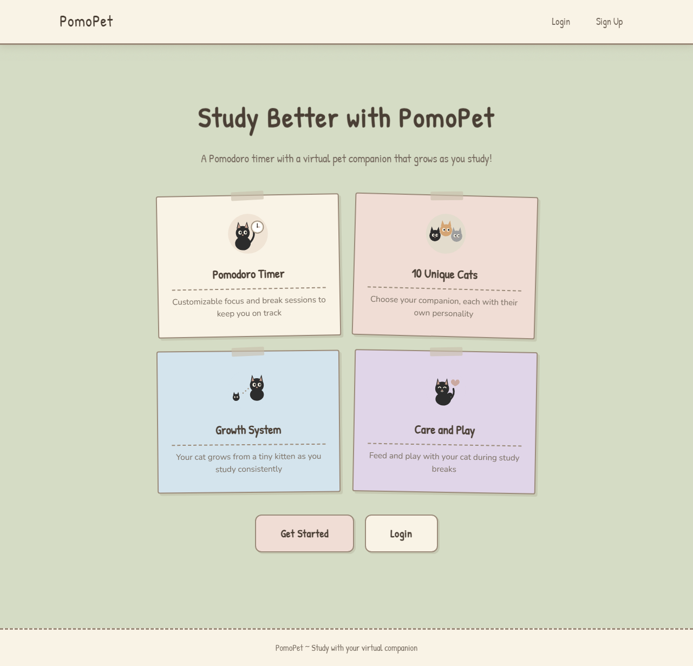
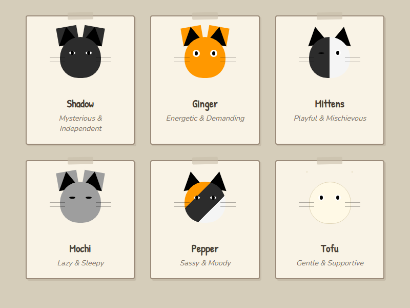

# PomoPet

A Pomodoro timer web app with a virtual cat companion that grows as you study. Built with a Studio Ghibli-inspired aesthetic.

**Live**: [pomopet.madebypragati.com](https://pomopet.madebypragati.com)



## Features

- Choose from 6 unique cat companions, each with their own personality
- Customizable focus and break timers (default or custom intervals)
- Cat grows, ages, and evolves based on your study sessions
- Mood, hunger, and happiness system -- neglect your cat and it gets sad
- Camera-based phone detection using TensorFlow.js (COCO-SSD) to track focus
- Focus scoring that penalizes distractions
- Feed and play with your cat during study breaks
- Email verification for account security
- Study statistics tracking

## Cat Companions



| Cat | Personality |
|-----|-------------|
| Shadow | Mysterious & Independent |
| Ginger | Energetic & Demanding |
| Mittens | Playful & Mischievous |
| Mochi | Lazy & Sleepy |
| Pepper | Sassy & Moody |
| Tofu | Gentle & Supportive |

## Tech Stack

| Layer | Technology |
|-------|------------|
| Backend | Python, Flask, SQLAlchemy, Flask-Login |
| Frontend | HTML (Jinja2), CSS, vanilla JavaScript |
| Database | PostgreSQL (Supabase) / SQLite (local) |
| AI/ML | TensorFlow.js, COCO-SSD (phone detection) |
| Email | Resend API |
| Hosting | Render, GitHub (CI/CD) |

## Quick Start

```bash
# Clone and set up
git clone https://github.com/pragati-lad/PomodoroPet.git
cd PomodoroPet
python -m venv venv
venv\Scripts\activate        # Windows
source venv/bin/activate     # Mac/Linux
pip install -r requirements.txt

# Add environment variables
# Create a .env file with:
# RESEND_API_KEY=your-resend-api-key
# MAIL_FROM=onboarding@resend.dev

# Run
python run.py
```

Visit **http://localhost:5001**

## Project Structure

```
app/
  auth.py           # Authentication & email verification
  routes.py         # Main app routes & API endpoints
  models.py         # Database models (User, Cat, StudySession)
  templates/        # Jinja2 HTML templates
  static/           # CSS, JS, audio files
config.py           # Environment-based configuration
run.py              # Application entry point
```

## License

MIT
